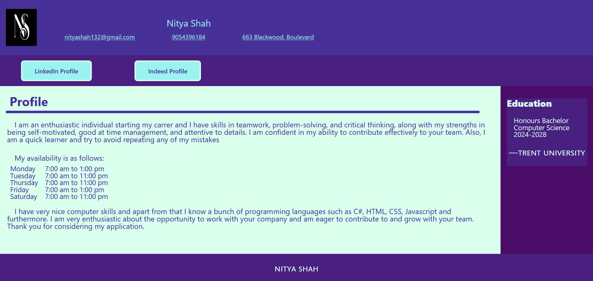
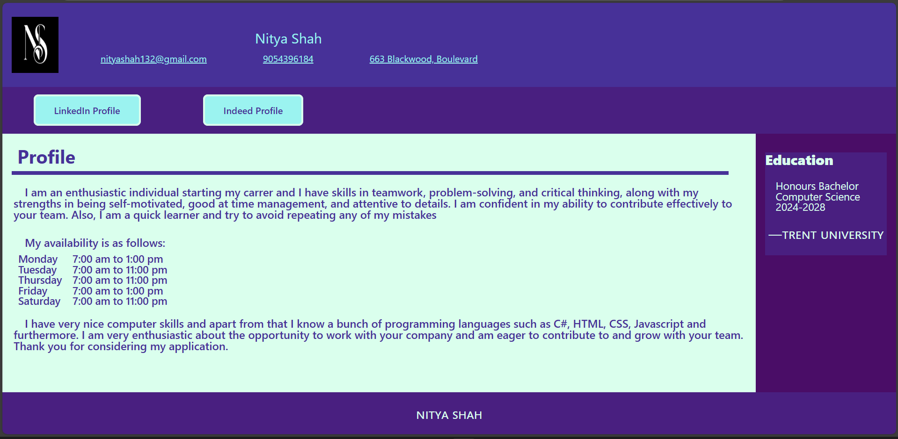
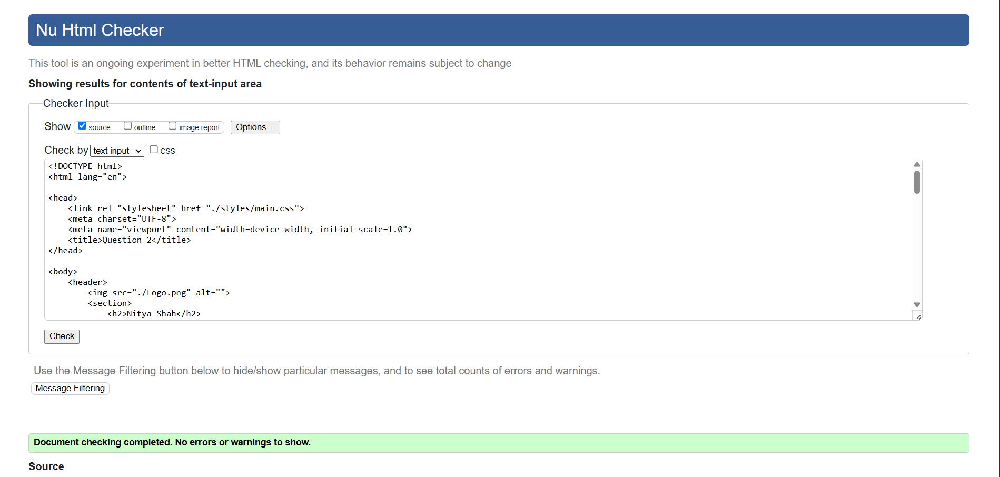
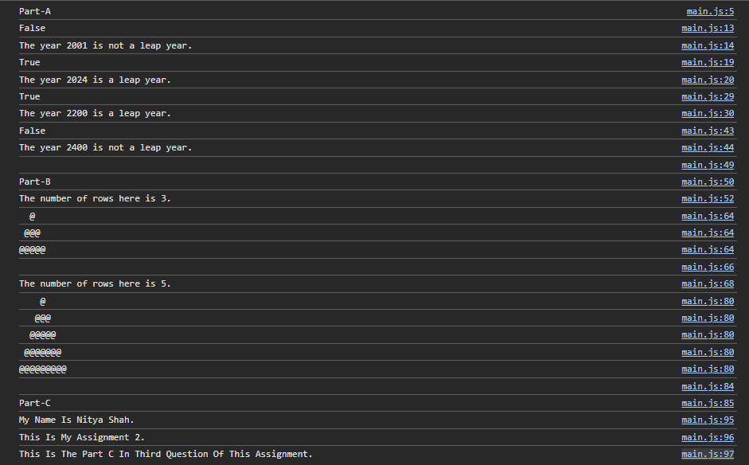
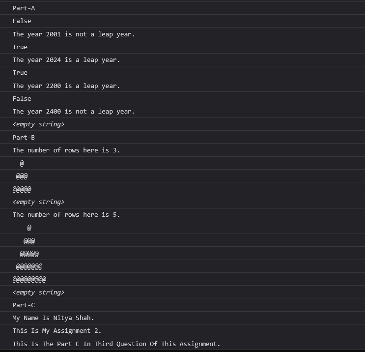
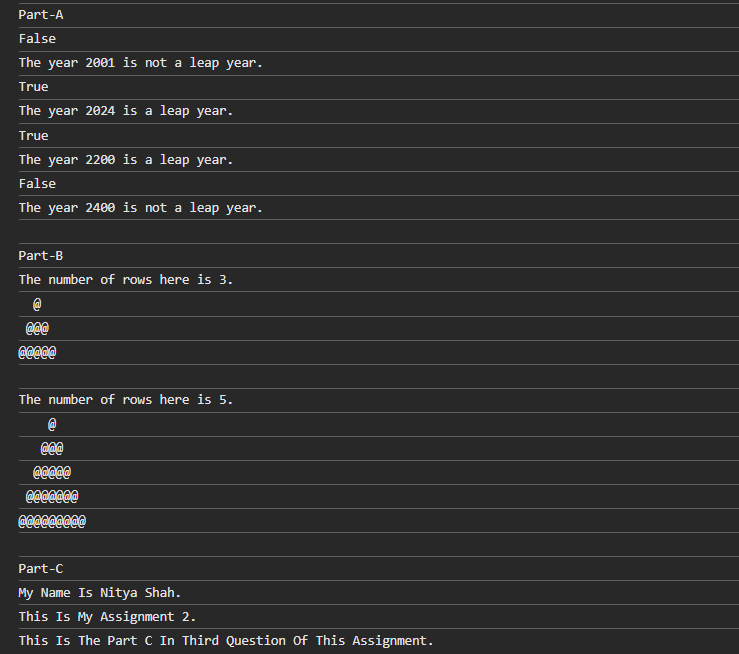

# Assignment #2 Testing Document

- Note: you don't need to include any code in this document, or export it to PDF. This should just be your labelled testing screenshots. Make sure to preview this document in GitHub online to ensure all your images load correctly or there will be marks deducted from your testing section.
- Make sure to put your screenshots into a folder for each question.

## Question-1

### HTML page view on Chrome

### HTML page view on Firefox

### HTML page view on Microsoft Edge

### HTML validation

## Question-2

### HTML page view on Chrome

### HTML page view on Firefox

### HTML page view on Microsoft Edge

### Html validation

### Color contrast test 1

### Color contrast test 2

### Color contrast test 3

### Color contrast test 4

### Color contrast test 5

### Color contrast test 6

## Question-3

### Console view on Chrome

### Console view on Firefox

### Console view on Microsoft Edge
