# Assignment #2 Testing Document

## Question-1

### HTML page view on Chrome
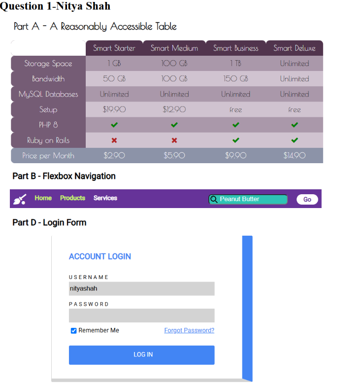

### HTML page view on Firefox
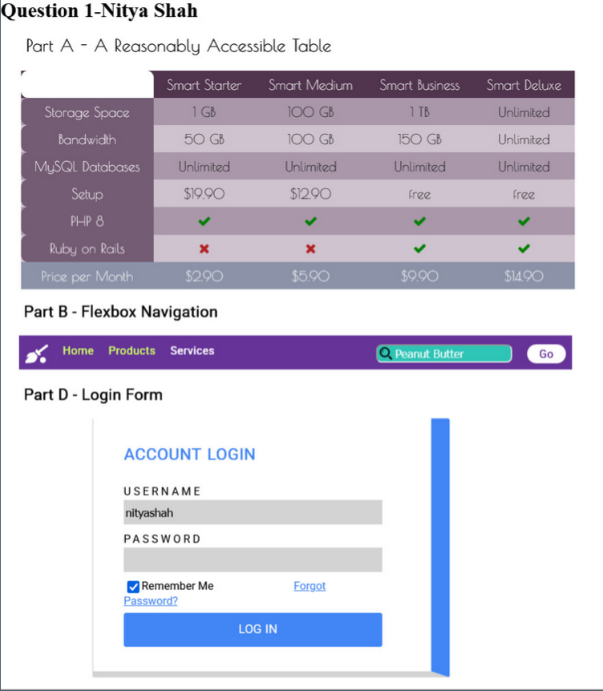

### HTML page view on Microsoft Edge
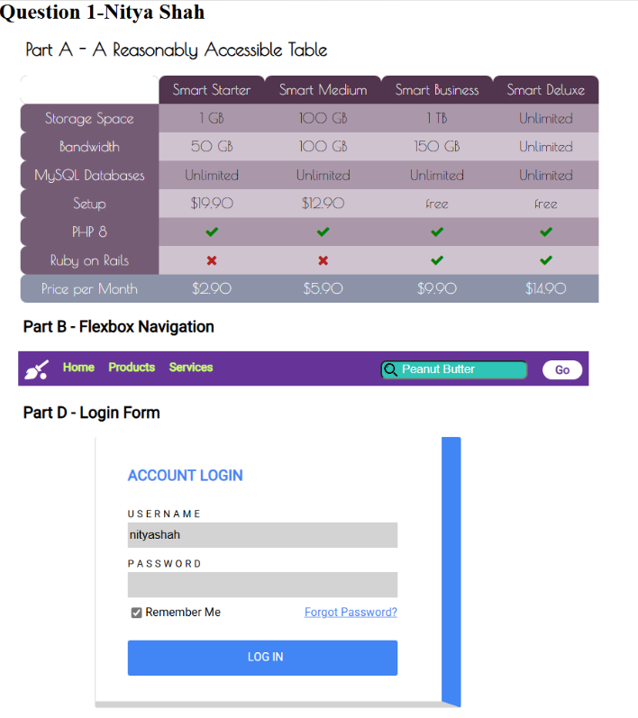

### HTML validation
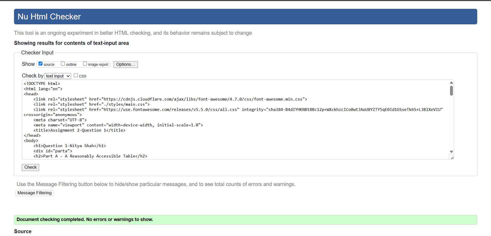

## Question-2

### HTML page view on Chrome

### HTML page view on Firefox

### HTML page view on Microsoft Edge

### Html validation
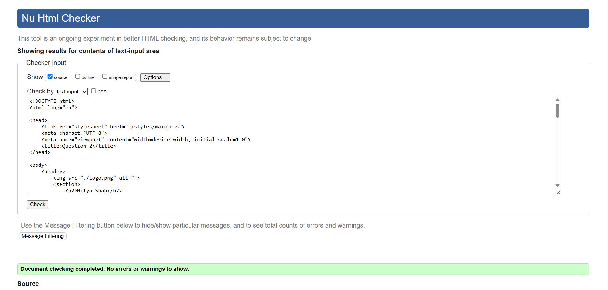

### Color contrast test 1
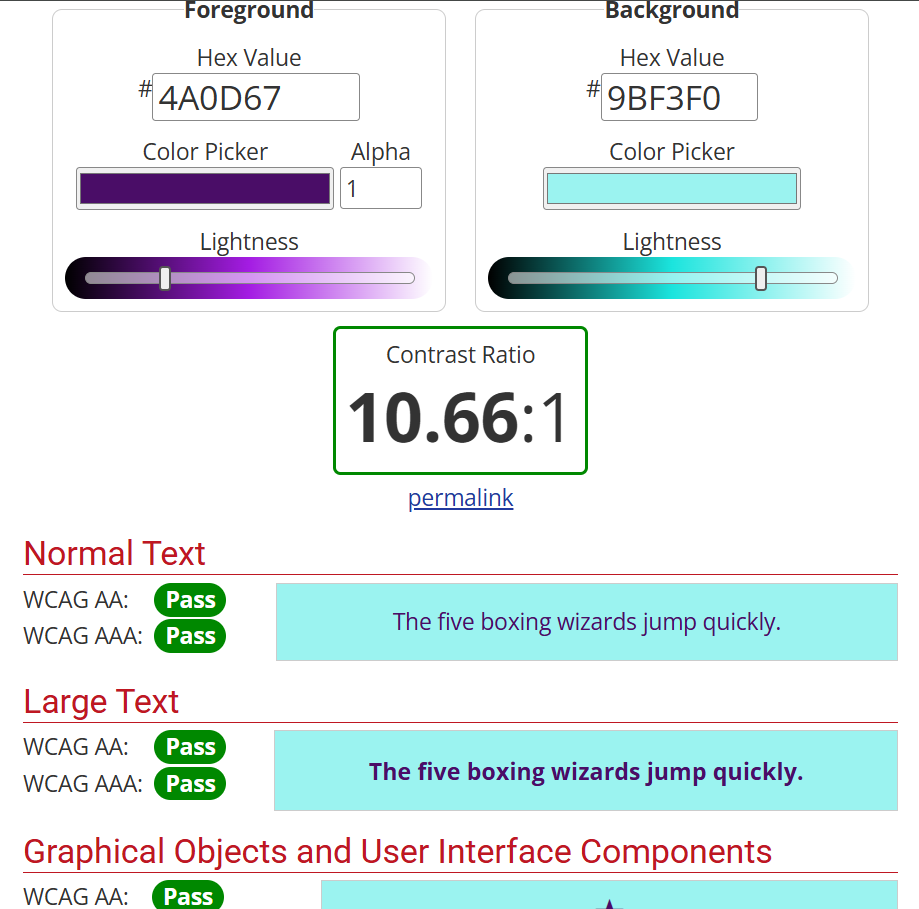

### Color contrast test 2
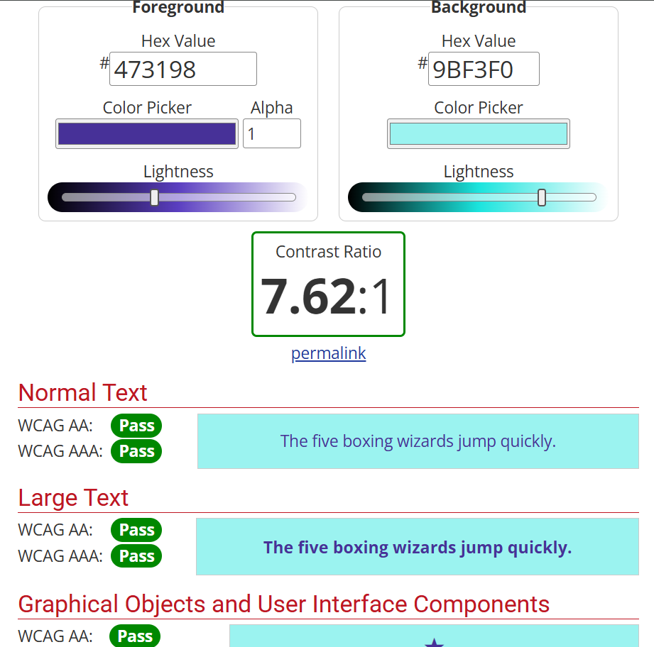

### Color contrast test 3
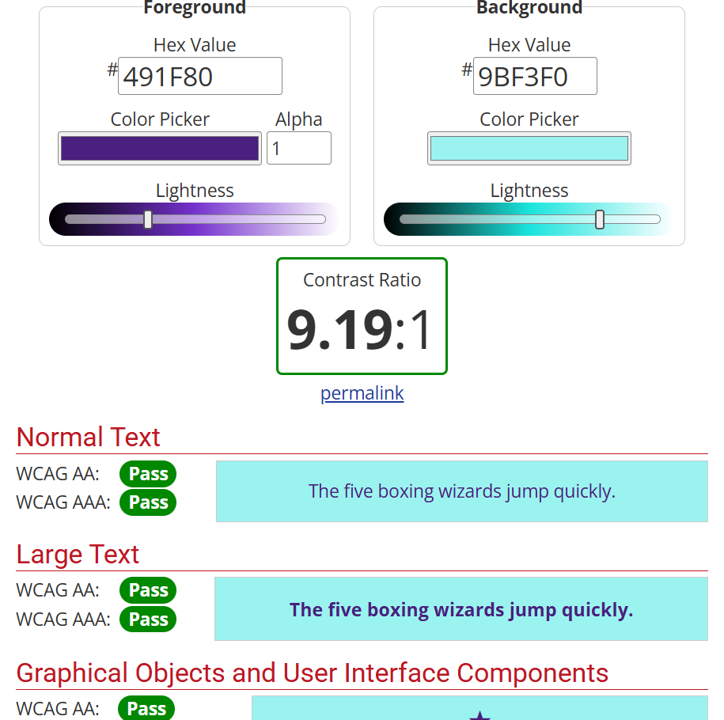

### Color contrast test 4

### Color contrast test 5
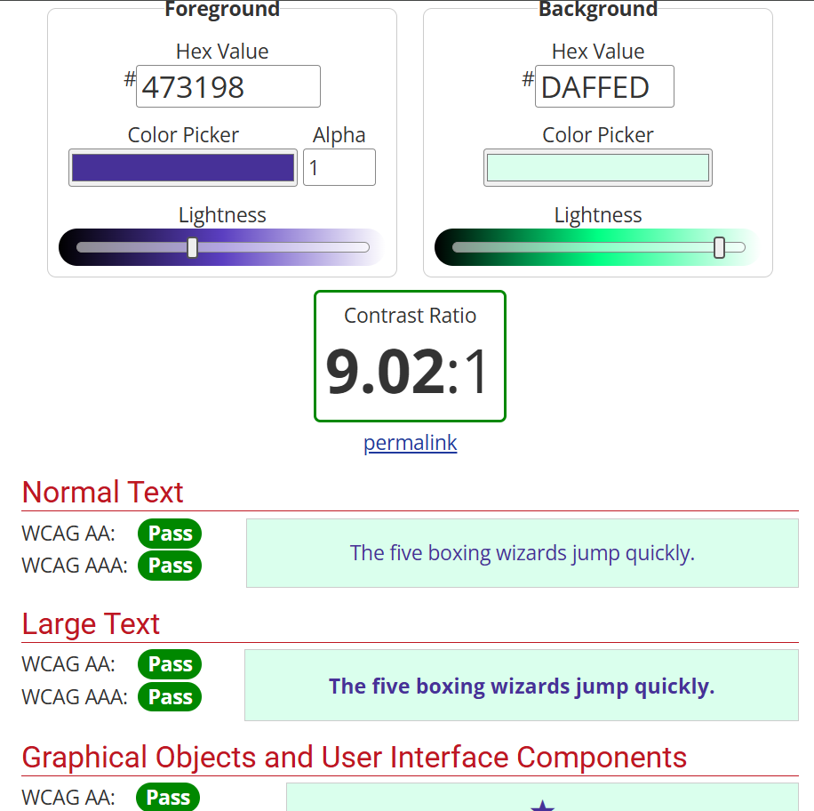

### Color contrast test 6
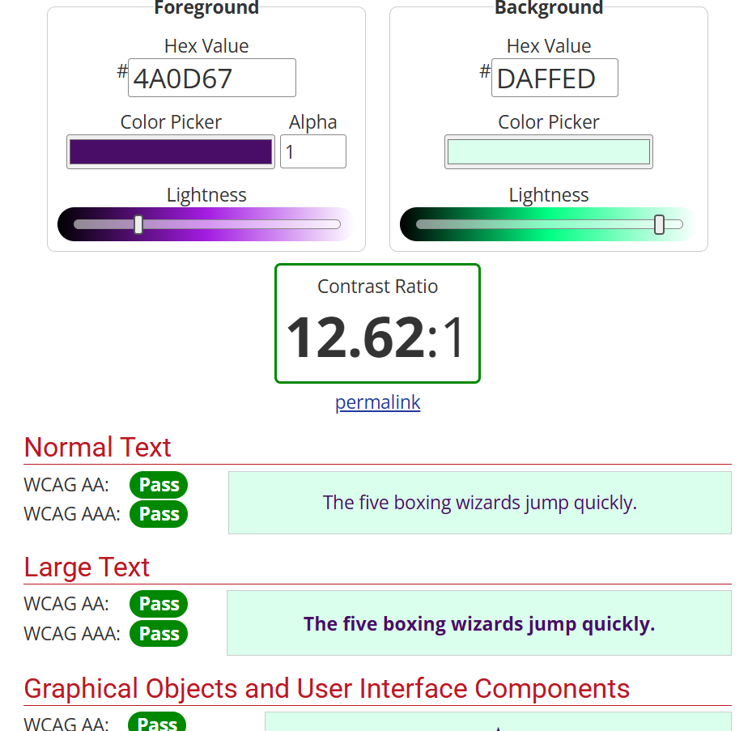

## Question-3

### Console view on Chrome
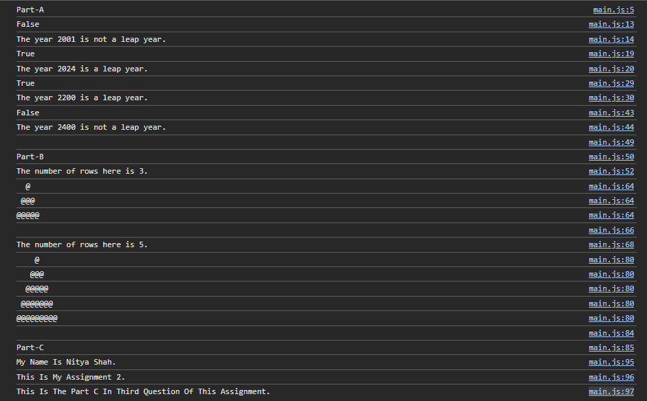

### Console view on Firefox

### Console view on Microsoft Edge
